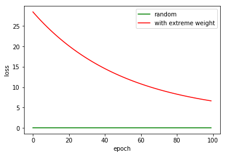

# About
Image classification using convolutional neural network with [CIFAR-10 dataset](https://github.com/sky-chen/dlnd/tree/master/project2)

# TODO
- train on AWS
- build model without pooling layer, as quoted by cs231n *"Discarding pooling layers has also been found to be important in training good generative models, such as variational autoencoders (VAEs) or generative adversarial networks (GANs). It seems likely that future architectures will feature very few to no pooling layers."*

# Weight Initialization
At first my CNN model was struggling with accuracy 10%, which is just random guessing. After some vain atteampt to debug, I heared people in slack channel talking about initializing network weights with truncated_normal() using a stddev = 0.1 rather than the default 1.0.

So I gave it a try, and boom! Over 60% accuracy in just a few training epoches! Initially I thought that a larger standard deviation should help break symmectric. But it turn out that if one (or some) initial weight is too large (or small) than others, it would dominate the network output, and network would take really really long to reach optimal point.


Point A would be a nice randomly distributed initial weight, point B has an extreme weight value in vertical dimension. (we have performed the data normalization, so the contour is more like a cycle rather than elipse) It's not that B is far away from optimal position, but it has **uneven distance from optimal** in horizontal and vertical dimension.

This is so important an lession that I need to make some experiments 


```python
import numpy as np
```


```python
def train(x, target, initial_weight, learning_rate, epoch):
    loss = []
    weight = initial_weight
    batch = x.shape[0]
    for i in range(epoch):
        output = np.dot(x, weight)
        error = output - y
        output_grad = error
        weight -= learning_rate * np.dot(x.T, output_grad) / batch
    
        mse = np.mean(error**2)
        loss.append(mse)
        
    return loss
```


```python
batch = 5
n_feature = 3
epoch = 100
learning_rate = 0.01
target_weight = np.random.random([n_feature, 1])

print(target_weight)
```

    [[ 0.47601234]
     [ 0.82609358]
     [ 0.72918892]]


```python
x = np.random.random([batch, n_feature])
target = np.dot(x, target_weight)

good_weight = np.random.random([n_feature, 1])
bad_weight = np.random.random([n_feature, 1])
bad_weight[0, 0] = 10  # assign an extreme value 

good_loss = train(x, target, good_weight, learning_rate, epoch)
bad_loss = train(x, target, bad_weight, learning_rate, epoch)
```


```python
from matplotlib import pyplot as plt

plt.plot(good_loss, 'g', label='random')
plt.plot(bad_loss, 'r', label='with extreme weight')
plt.xlabel('epoch')
plt.ylabel('loss')
plt.legend(loc='best')
plt.show()
```




